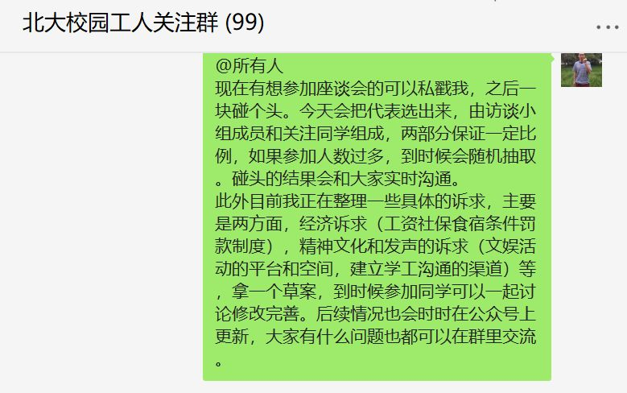

# 【持续更新】校工访谈座谈会代表已选出（原载于公众号“为了他们的微笑”）

5月10号下午，展振振同学就校园访谈中的问题向校长信箱写信，

随即收到了学校的回应，有相关工作人员回了电话。经过沟通，电话里的工作人员表示学校六个相关部门将于下周（具体时间和地点没有确定）各自派出代表，与学生进行座谈，沟通各自了解到的情况，并商讨解决问题的方案。

当晚，展振振同学拉起了北大校园工人关注群。关注此事的同学在里面一起讨论有关座谈会的想法和诉求。
 
5月12号下午，我们商定了座谈会的人选。通过自愿报名的方式，在校园工人关注群和访谈小组当中，各自产生了几名代表。

接下来，代表们将一起商议讨论，准备座谈会的具体诉求，同时会与校园工人关注群里的同学进行沟通，以完善我们的建议诉求，最新情况会在公众号上实时更新。对诉求有建议或是愿意一起讨论想法的同学，欢迎你们进群，在公众号后台留言即可。

我们热切地期待这次座谈会，期待问题得到解决！