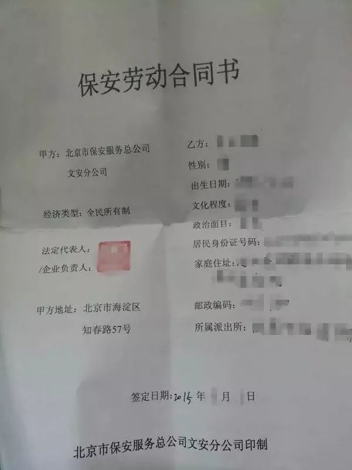
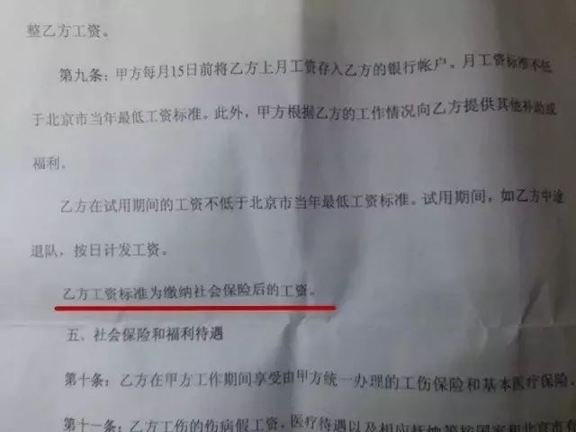
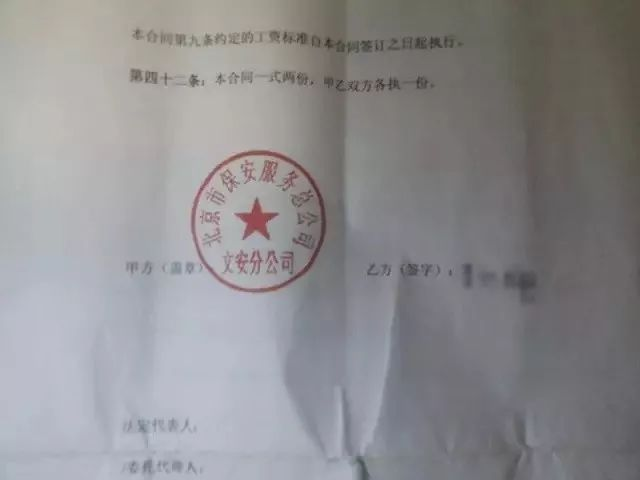
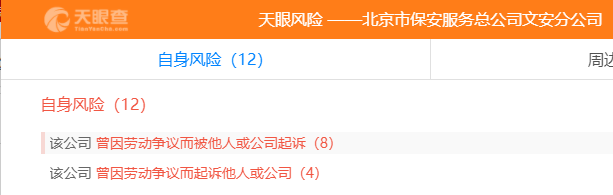
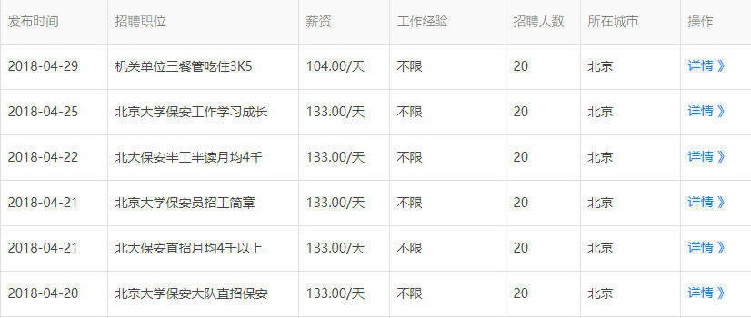
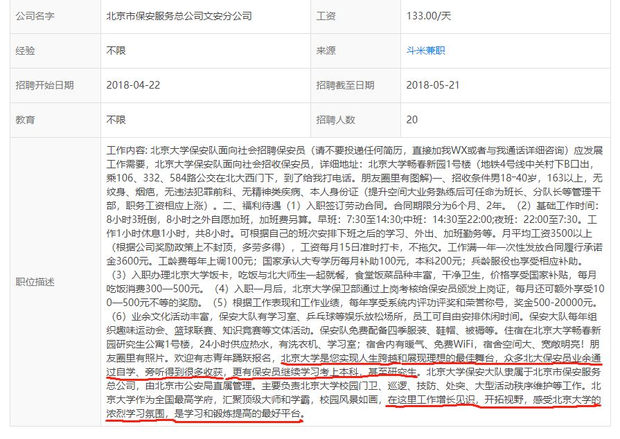

# 雄踞北大的文安公司到底什么来头？（原载于公众号“NorthPKU”）

北大这片园子，经常发生许多大新闻。
 
这里的“大新闻”，主要是同学与学校之间发生的故事，例如约谈事件、念错字事件等。
 
而昨日曝光的校内保安被带走谈话一事，在某种程度上已经超出了这一范畴。
 
倘若说对待校内大新闻，我们可以采取戏谑、调侃的态度，但对于昨日一事，我们不得不提起十二万分的精神——删tie力度前所未有，很多同学戏称自己是“一转没”、“一点没”，然而戏谑背后隐含的是深深的无奈，我们发现，如果他们想在大家眼皮子底下封锁一条消息，是完全可以做得到的。**四月份以来的一系列事情难道不都是这样吗？**
 
**正义从来不是等来的，北大这片园子的进步靠的是北大人的共同奋斗。**
 
而在保安被带走的那篇文章中，涉及一关键方——北京市保安服务总公司文安分公司。为了推动事件的解决，我尽可能地汇总了关于文安公司的一些情况：

## 报告里的文安公司

2018年北大校园工人访谈记录当中，与“文安公司”相关的描述单独出现了2次：
 
第一次出现是在“工资待遇”一节，作为例子说明校内职工的超时加班现象：

>二、保安所在的文安公司虽然采取综合工时制，即综合计算周期内的某一具体日（或周、或月、或季）超过法定标准工作时间是允许的，但同样需要遵循劳动法延长工作时间每日不得超过三小时，但是每月不得超过三十六小时的规定。北大保安在轮休制下，每周休息时间不足一日，同样涉嫌违反劳动法。

第二次出现是在“精神生活与人际关系”一节，作为例子说明校内职工业余生活的空虚：

>即使是看书，也显得很奢侈（4.3%），在我们调查到的工人中，有11位工人业余生活会读书，而且全是保安。但是据他们说，即使是读书，也只是消遣，读读小说与成功学。只有2个人仍然在读着专业书籍。虽然很多人是慕名而来，抱着来这里学习考取文凭的目的，但是在这里呆了几个月之后，能坚持看书的也很少了。不规律的上班时间，频繁的加班（加班时一天工作16小时），宿舍里不上班就打游戏的室友，导致他们很难能有一个合适的氛围静下来学习。

以同样的方式，我们再看2015年北大某社团牵头组织撰写的《北大后勤工人调研报告》，保安队单独出现了**3次**：
 
第一次出现时，保安队作为“”社保缺失的重灾区”的面目出现：

>社保缺失的另一个重灾区是保安队，承担北大校本部安全保卫任务的是北京市保安服务总公司文安分公司(工商注册号：110000004135735，以下简称“文安公司”)第一大队下辖的几个分队。\
据我们了解，文安公司没有为在北大工作年限在两年以下的任何一名保安缴纳过社会保险。一名曾经在保安队工作过的保安向我们展示他和文安公司签订的劳动合同上明白地写着“乙方工资标准为缴纳社会保险后的工资;乙方在甲方工作期间享受由甲方统一办理的工伤保险和基本医疗保险。”\
\
\
\
*文安公司和职工之间的劳动合同*\
*为保护当事工友，已对身份信息做了相应的技术处理*\
\
这位工友曾到海淀区人社局的官网查询他的社保缴费记录，结果显示为空。他在离职后到保安队找某位负责人讨要一个说法，希望公司帮忙补缴欠下的社保，却得到以下回应：“有句话叫‘胳膊拧不过大腿’，你出身农村我又不是不知道，公司的力量比你不知道强多少倍，不信就去告啊，没用的，劝你还是省省吧。”文安公司不按法律规定发放加班费(据了解，学校每逢重大活动会临时增加岗位，这时可能会需要加班)以及不缴社保的做法也得到了其他岗亭保安兄弟的印证。

第二次出现则是强调身为文安公司下属的保安兄弟在精神生活上的空虚，并对保安队伍内部的人际关系氛围进行描述：

>几名保安兄弟曾向我们调侃公司弄的企业文化宣传，比如“公司是员工的衣食父母”之类，他们称之为鬼话。此外我们了解到，在保安队偶尔会发生上级与下级之间的冲突，多数是由工资和社保问题引发的。我们分批走访过5个保安宿舍，发现每个宿舍的工友之间并没有多少交流，经常看到的是画面是每个人都在低头玩手机，有室友下班进来后也不会打招呼。

第三次出现则对于保安兄弟进行专门的调查，希望通过他们对未来的规划来展示当前他们自己的精神生活状态：

>针对年轻工友这一特殊群体，访谈过程中我们倾听了他们对未来的规划和展望。“迷茫”是很多受访保安在面对这个话题时的第一反应。\
关于未来的打算，53%的保安选择回家乡创业，37%希望将来能在城市里找到一份工作并定居下来，10%表示没想好或打算回家乡务农。\
我们注意到一个细节——保安的流动性非常高。一名保安说过：“经常是刚和一哥们认熟，结果他就辞职了。”很多保安是为了利用北大的学习资源才过来上班，但是他们很快就会发现一个令人尴尬的事实：工人不被允许进入图书馆，除非有教师的担保和证明。

尽管15年的调查报告与18年的访谈记录之间，已经相隔了两年多的时间，但文字当中所反映的文安公司的问题却是非常相近的。

## 文安公司历史

但是真实情况是否如报告当中所述呢？
 
或许文安公司所经历的历史可以告诉我们。
 
我们在天眼通网站上查询了“北京保安服务总公司文安分公司”的法律诉讼记录。

*（图片来源：https://www.tianyancha.com/company/3427228?useraction=risk ）*

从2013年12月至今，天眼通上过有记录的诉讼案件便有12条，**而这12条全部由公司与基层保安员之间的劳动争议所致**，大多发生在保安员离职时。保安员的基本诉求主要针对文安公司没有缴纳社保、没有按照法律规定发放加班费等行为，要求文安公司补足基本的工资待遇。
 
我们以查到的《北京市保安服务总公司文安分公司与李成田劳动争议二审民事判决书》作为例子分析文安公司出现的违法行为是否属实。
 
在这起案件当中，保安员李成田于2011年11月14日入职文安公司，双方曾签订期限自2011年11月14日至2013年11月14日期间的劳动合同，约定试用期1个月。然而在2013年3月4日李成田在工作过程中被同事打伤，随即停止工作接受治疗，他因工致残被鉴定为九级伤残。

后来，李成田以文安公司未为其缴纳社会保险、其本应享有的权利得不到及时、合理的安排和处理为由，提出辞职，然而双方在支付一次性伤残补助金、一次性伤残就业补助金、一次性医疗补助金、停工留薪期和解除劳动合同经济补偿金的问题上起了冲突，因此文安公司对此进行上诉。

最终的结果，在判决书当中是这样写的：

>李成田以文安公司未为其缴纳社会保险为由向文安公司提出解除劳动关系，而文安公司确实存在没有为李成田缴纳社会保险的情形，故文安公司应当向李成田支付解除劳动合同经济补偿金。

这意味着文安公司存在没有为员工缴纳社会保险的状况是经由法院认定的。我们无从推证这种现象是否普遍且从当时到现在整体情况是否改善，不过从最新的情况来看，至少个别案例仍不断发生。
 
在落款为2016年5月26日的《石波诉北京市保安服务总公司文安分公司劳动争议一案》当中，关于加班费的认定如下：

>本院已明确查实该公司支付法定节假日加班工资的标准低于法定标准

在落款为2016年11月25日的《田博与北京市保安服务总公司文安分公司劳动争议一审民事判决书》当中，法院关于文安公司的行为做了如下事实认定：

>另查，保安文安分公司未为田博缴纳社会保险。

由于事实材料尚且不足的原因，我们暂时无法对文安公司下一个匆忙的结论，但我们相信，**更多的答案掌握在北京大学一个个鲜活的保安兄弟手中。**

## 文安公司与“高校保安梦”

北京文安网是这样介绍文安公司的：

>北京市保安服务总公司文安分公司自1992年1月成立以来，由原来的几十名保安员，现已拥有以首都高校为载体的3500余名的保安队伍，为北京大学、清华大学、中国人民大学、中央民族大学等近40所首都高等院校、科研、文化、医疗等200多家客户单位提供有偿保安服务。

*（来源：http://www.bjwaw.com/about-22.html ）*

从本质上来说，文安公司与全国任何一家保安公司没有任何区别，都是提供有偿保安服务，仅此而已。
 
不过相比普通保安公司，文安公司的优势非常明显，即它的服务对象本身附带很高声望价值，人们往往把“北大”与“资源丰富”“前景广阔”相联系起来。
 
联系到第一部分中保安员提到的“为了北大过来却没法读书”的现象，这里便存在一个问题：**文安公司在主观上是否利用北大等高校的招牌到人力市场招募员工呢？**

关于这一点我们可以从网络的招聘广告和宣传文章上找到一些线索。
 
下面这张图是我们在网站“天眼通”当中搜索到的文安公司招聘情况。我们从招聘的文案当中可以看到**“学习成长”“半工半读”**的字眼：

点击“详情”之后，可以看到具体的招募信息如下：

职位描述当中用了不少的篇幅来描述北京大学良好的学习氛围，并且写下“**在这里工作增长见识、开拓视野，感受北京大学的浓烈学习氛围，是学习和锻炼提高的最好平台**”这样的语句，很容易对人们产生错误的引导。
 
此外，在北京文安网的宣传文章《文安保安20余载铸就辉煌》当中有这样的描述：

>这些年来，文安分公司重视企业文化建设，尤其是在保安员自学成才方面，由于公司和客户单位的大力支持和保安员的不懈努力，有不少保安员圆了大学梦。据不完全统计，目前在基层保安队伍里获得大专、本科、研究生学历的保安员和管理干部近700人，与此同时，还有1300余名保安员获得驾驶员、计算机等技术证书。人民日报等国内多家媒体进行报道，中国日报以外文版向世界报道。在保安员的文化学习中，驻北大保安队以北大自身的优越学习条件，极力打造学习型保安企业，多年来，近300名保安员获得了自考、成考的专科和本科学历，保安大队长张国强就是一个模范典型，他是获得双学历的首都保安系统第一人。

*（来源：http://www.bjwaw.com/about-24.html ）*

在公司的宣传文章当中，很显然已经把高校的学习氛围融入到文安公司的内部建设当中，更加鲜明直观地看出公司的宣传特点。这种宣传与基层员工实际享有的学习待遇形成绝对的反差，我想这也是导致保安兄弟们困惑迷茫的重要原因之一。

通过种种线索来看，无论是文安公司的招聘宣传，还是保安兄弟的生存现状，保安兄弟所说的情况在逻辑上是连贯的。

## 结语

下周部分关注校内工友的同学们将与校方各个部门召开座谈会，希望在这次座谈会上人们能够对文安公司已经确证的所作所为做一个反思。

我认为，北大之所以为北大，正在于“常为新”的勇气，正在于“常与黑暗势力抗争”。

**如果任何一家商业公司想借助北大的名声胡作非为，任何一位北大学子都将坚决说“不”。**